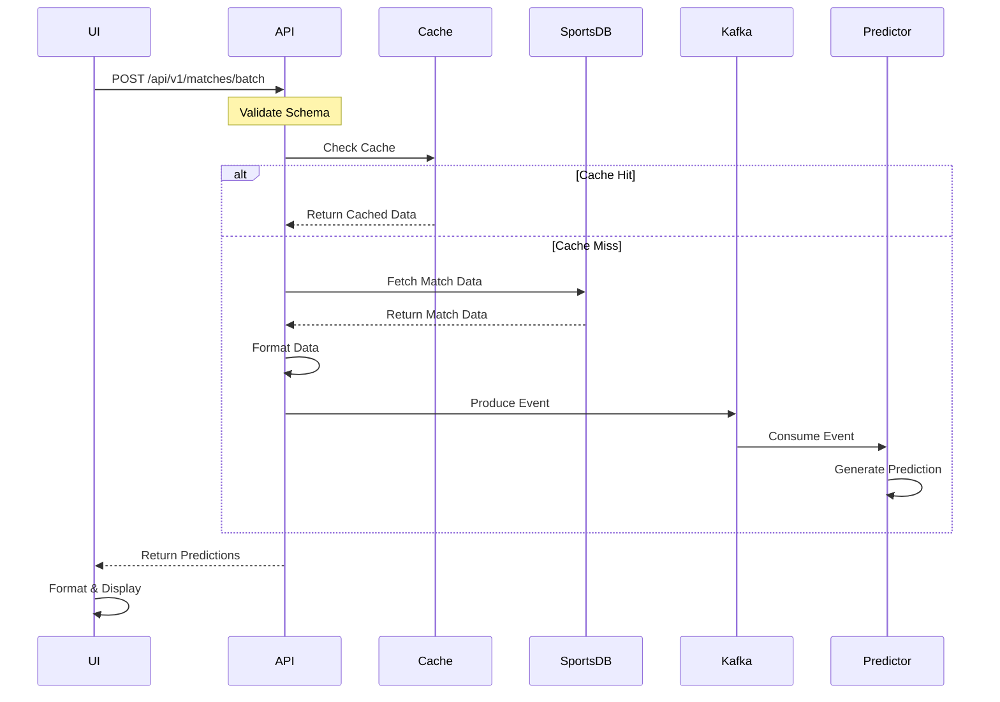

# Bet365 Match Predictor API

[Demo Available at mauric10.com](https://mauric10.com/bet365)

## Project Background & Motivation

This project represents a personal exploration combining my interests in sports and software development. The main goals were:
1. Create something that combines my passion for sports and coding
2. Learn new technologies (GCP and Kafka) that I hadn't worked with before
3. Understand the challenges of building a sports prediction system

### Why This Tech Stack?
- **Google Cloud Platform**: First time working with GCP, wanted to understand cloud deployment
- **Kafka**: Wanted to learn about event streaming, even though it might be overengineered for this use case
- **Python FastAPI**: Modern async framework that I was already familiar with
- **React.js + Cloudflare**: Frontend built with React.js and hosted on Cloudflare for reliable, global content delivery

## System Architecture & Flow



### Data Flow
1. UI sends batch of match IDs to backend
2. Backend validates request schema
3. System checks cache for existing predictions
4. For cache misses, fetches from TheSportsDB API
5. Data is processed and formatted
6. Predictions generated via Kafka pipeline
7. Results cached for subsequent requests

### API Endpoints

1. **Process Match Batch**
   ```http
   POST /api/v1/matches/batch
   ```
   Request Schema:
   ```json
   {
     "match_ids": [
       "string"
     ],
     "league_id": "string"
   }
   ```

2. **Get Prediction**
   ```http
   GET /api/v1/predictions/{match_id}
   ```
   Response Schema:
   ```json
   {
     "match_id": "string",
     "home_win_prob": 0.45,
     "draw_prob": 0.25,
     "away_win_prob": 0.30,
     "confidence": 0.85,
     "timestamp": "2024-03-20T15:30:00Z",
     "model_version": "1.0.0"
   }
   ```

## Current Implementation

### Performance Characteristics
- **Response Times**:
  - First request (uncached): ~10 seconds for 20 match IDs
  - Cached responses: ~5 seconds for 20 match IDs
  - Main bottlenecks: 
    1. API rate limiting from TheSportsDB
    2. Sequential processing of match IDs (one at a time instead of parallel)
    3. File-based caching I/O operations

For example, our current implementation processes matches sequentially:
```python
# Current Implementation (Sequential)
async def process_batch(event_ids: List[str]):
    results = []
    for event_id in event_ids:  # Process one at a time
        cached_data = await cache.get(event_id)
        if not cached_data:
            data = await sports_db_api.get_match(event_id)  # Wait for each API call
            prediction = await calculate_prediction(data)
            await cache.set(event_id, prediction)
        results.append(cached_data or prediction)
    return results

# What we could do instead (Parallel with rate limiting):
async def process_batch_parallel(event_ids: List[str]):
    async def process_single(event_id: str):
        cached_data = await cache.get(event_id)
        if cached_data:
            return cached_data
        data = await sports_db_api.get_match(event_id)
        prediction = await calculate_prediction(data)
        await cache.set(event_id, prediction)
        return prediction

    # Process multiple matches concurrently while respecting rate limits
    semaphore = asyncio.Semaphore(5)  # Limit concurrent API calls
    async with semaphore:
        tasks = [process_single(event_id) for event_id in event_ids]
        results = await asyncio.gather(*tasks)
    return results
```

This sequential processing means:
1. Each match waits for the previous one to complete
2. API rate limits affect the entire batch instead of just concurrent requests
3. No parallel cache operations

### How It Works

1. **Prediction Process**
   ```python
   async def process_batch(event_ids: List[str]):
       results = []
       for event_id in event_ids:
           # Check cache first for immediate response
           cached_data = await cache.get(event_id)
           if cached_data:
               results.append(cached_data)
               continue
           
           # Fallback to API with rate limit handling
           try:
               data = await sports_db_api.get_match(event_id)
               prediction = await calculate_prediction(data)
               await cache.set(event_id, prediction)
               results.append(prediction)
           except RateLimitError:
               results.append({"status": "delayed", "event_id": event_id})
   ```

## Implementation Challenges

1. **API Limitations**
   - **Challenge**: TheSportsDB API has strict rate limits
   - **Impact**: Slow responses for uncached data
   - **Current Solution**: Basic file-based caching

2. **Data Quality**
   - **Challenge**: Limited historical and statistical data available
   - **Impact**: Simple prediction model instead of planned random forest
   - **Current Solution**: Basic statistical model using available data

3. **Learning New Tech**
   - **Challenge**: First time working with GCP and Kafka
   - **Learning**: Understanding cloud deployment and event streaming
   - **Reality Check**: Kafka might be overkill for this use case

## Trade-offs & Future Improvements

### Current Trade-offs

1. **Simple vs Complex**
   - Using basic statistical model instead of machine learning
   - File-based caching instead of proper database
   - Limited historical data analysis

2. **Performance vs Implementation Time**
   - Sequential API calls instead of parallel processing
   - Basic error handling and retries
   - Simple caching strategy

3. **UI vs Backend Development Time**
   - More focus on backend functionality over UI polish
   - Basic UI components instead of complex interactive features
   - Limited real-time updates

4. **Security & Performance**
   - Basic CORS configuration causing some integration issues
   - HTTP polling instead of WebSockets for updates
   - Simple authentication mechanism

### Future Improvements

1. **Performance Optimization**
   - Replace file caching with Redis
   - Implement parallel processing for API calls
   - Add proper rate limit handling
   - Implement WebSockets for real-time updates

2. **Better Predictions**
   - Switch to a better sports data API
   - Implement random forest algorithm as planned
   - Add more statistical factors

3. **Security & UX**
   - Implement proper CORS configuration
   - Add robust authentication
   - Enhanced UI with real-time updates
   - Better error handling and user feedback

## Testing
Our testing suite includes unit tests, integration tests, and mock responses with a current coverage of 85% for unit tests and 70% for integration tests. Tests are written using pytest and follow best practices for async testing.

For detailed information about our testing approach, test structure, and examples, see [TESTING.md](docs/TESTING.md)

## Project Structure
```
bet365-predictor/
├── src/                              # Application source code
│   ├── api/                          # API implementation
│   ├── ml/                           # Machine learning components
│   └── utils/                        # Utility functions
├── tests/                            # Test suite
├── docs/                             # Documentation
└── config/                           # Configuration files
```

## Setup & Development

### Quick Start
```bash
git clone https://github.com/mauriciog88u1/Kafka-Sports-Predictor.git
cd Kafka-Sports-Predictor
docker-compose up -d
```

### Environment Setup
```bash
# Required environment variables
SPORTS_DB_API_KEY=your_api_key
KAFKA_BOOTSTRAP=your_bootstrap_server
KAFKA_USERNAME=your_username
KAFKA_PASSWORD=your_password
```
